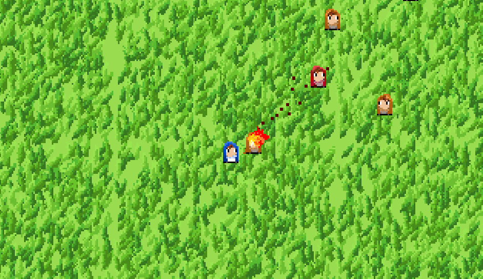
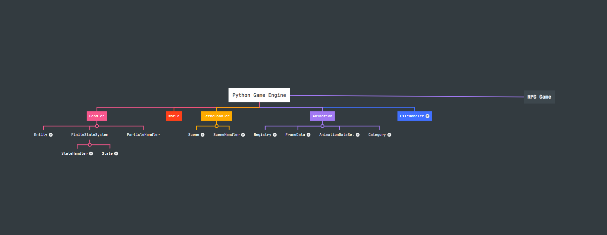
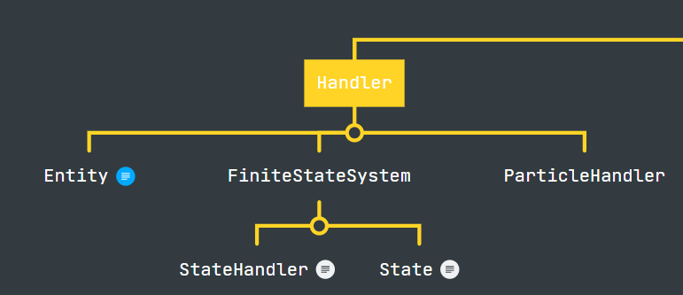
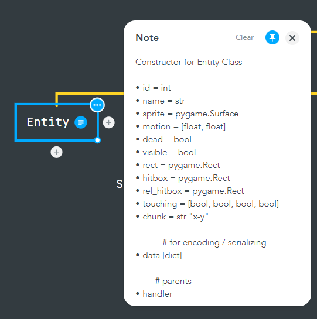
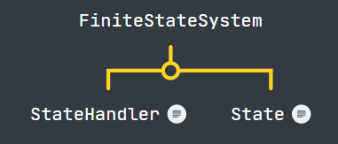
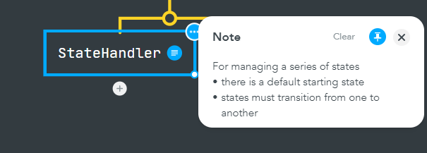
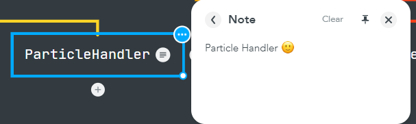

# RPG-Game-2D

An RPG Game made in python using the pygame engine

# Design

Idk how to explain the design but its kinda confusing

Here is an oversimplified mindmap for whats going on there

## Handler

The handler handles entities :)

### Entity

### FiniteStateSystem

#### State

#### StateHandler

### ParticleHandler

